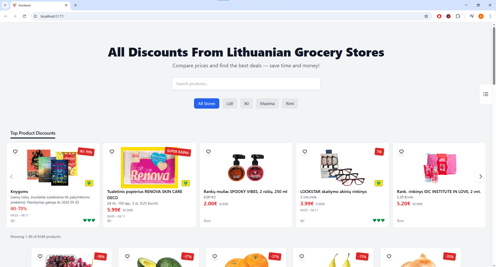
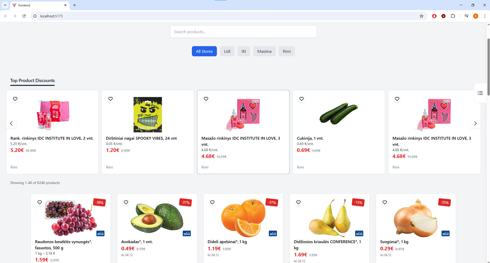
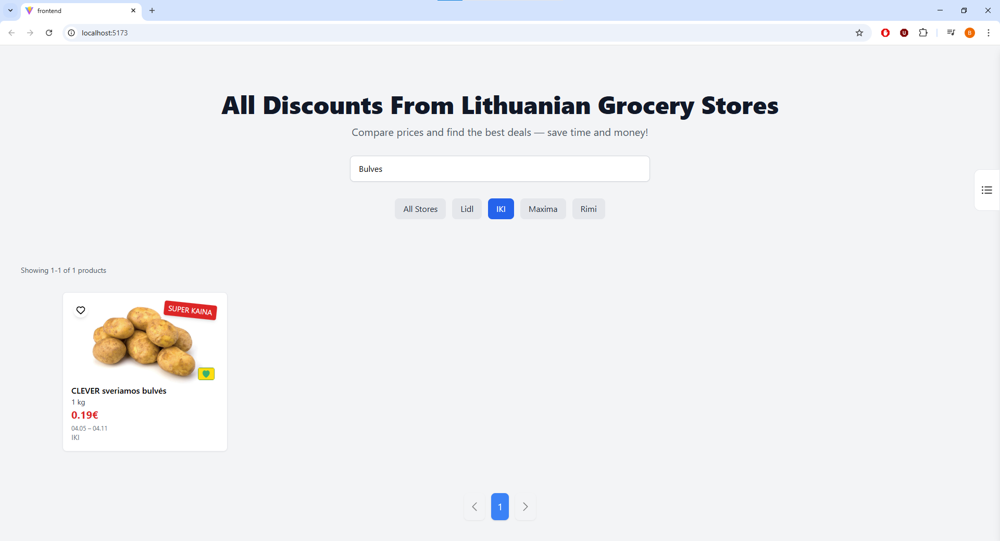
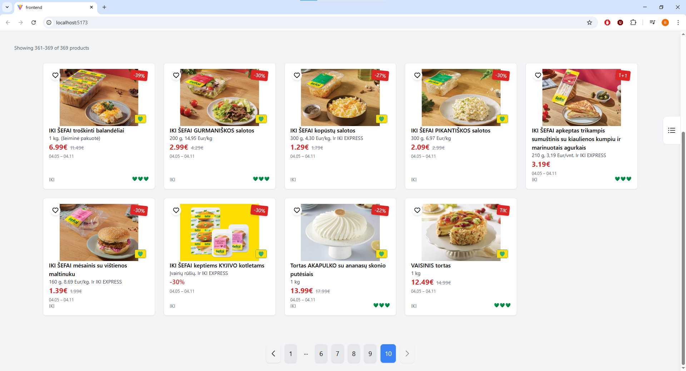
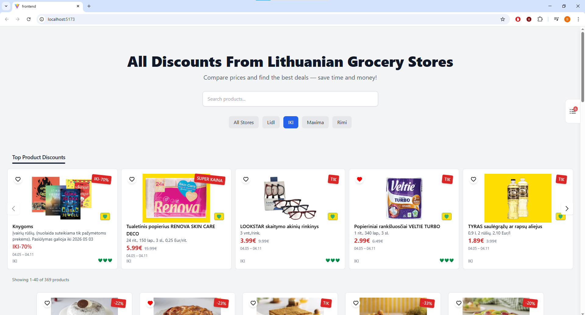
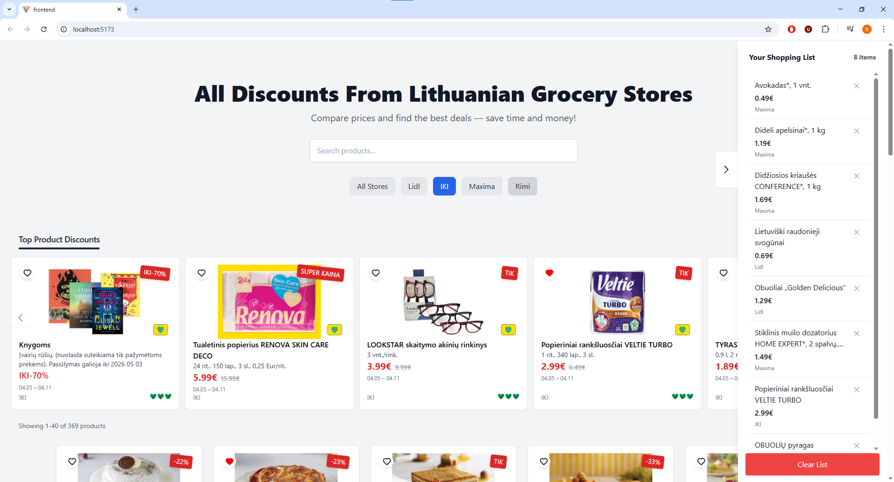

# Lithuanian Grocery Store Discount Aggregator App

A web application that aggregates and displays discounted deals from major grocery stores in Lithuania, helping users find the most optimal deals and compare across different stores.

## Features

- 🔎 Smart product search with synonym matching
- 🏪 Filter by grocery store (Lidl, IKI, Maxima, Rimi)
- 💰 Best deals carousel based on discount percentage calculations
- 📄 Pagination for large product datasets
- 🖼️ Product cards with pricing and deal badges
- ⚡ Backend-powered search and filtering
- ⭐ Save favourite products using localStorage

# Tech Stack

**Frontend:**
- React
- Tailwind CSS

**Backend:**
- Node.js
- Express.js

**Database:**
-PostgreSQL

# How It Works

- Product data is scraped from grocery store sources
- Backend normalizes product information such as names and prices
- Discount percentages and other values are also calculated from extracted data
- Frontend requests filtered and paginated product data via API

## Installation

### 1. Clone the repository
git clone https://github.com/BenasUrba/discount-aggregator.git

### 2. Install dependencies

Frontend:
cd frontend
npm install

Backend:
cd backend
npm install

### 3. Start the app

Backend:
node .\backend\server.js

Frontend:
npm run dev

## Environment Variables

Create a `.env` file in the main folder frontend folder:

main outer folder:

DB_USER=your_username
DB_HOST=localhost
DB_DATABASE=your_database
DB_PASSWORD=your_password
DB_PORT=5432

frontend:

VITE_API_URL=http://localhost:5000

## Screenshots

### Home Page

## Future Improvements

- Improve search ranking to allow for more relevant result order
- My products section to display full product info
- Add ability to export list to device